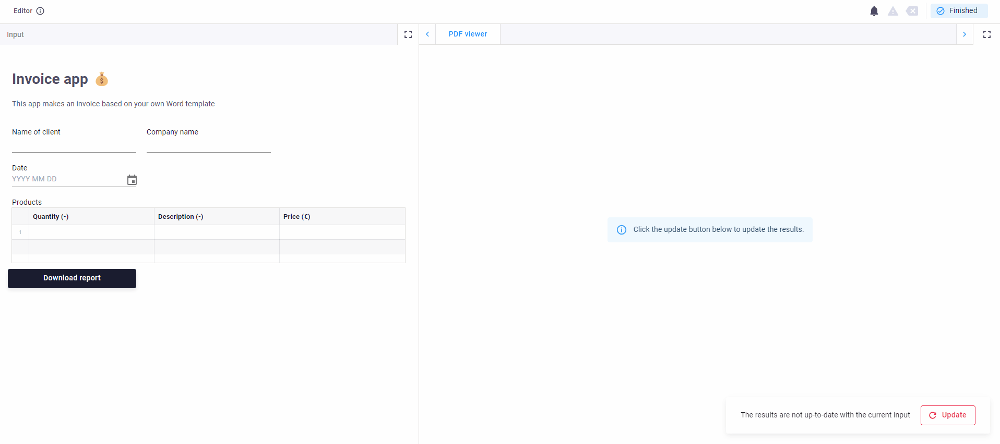
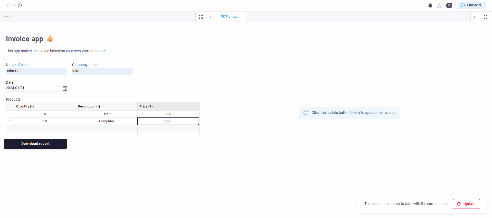
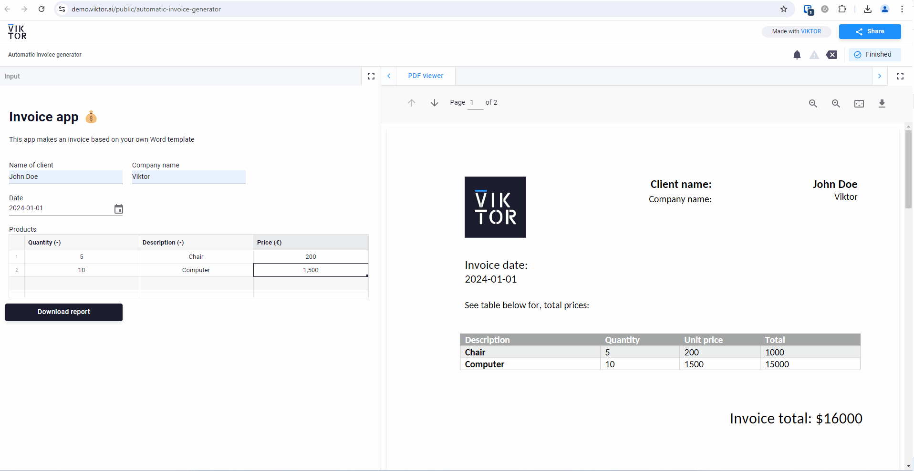

# Automatic Reporting 🗎
As an engineer or data scientist, generating reports is an essential part of your work. Reporting not only helps you 
understand the insights from your data but also helps you communicate your findings/results to stakeholders. In this 
app, the process of generating invoices is automated in VIKTOR with python 💰.

This app includes:
- Inserting information like the name of the client and company, the date of the invoice and a list of the products.
- Filling a Word template with the information.
- Displaying the filled Word file.
- Downloading the Word file.

## Step 1: Filling the information
Fill in the name of the client and company, the date of the invoice. For each product, the quantity, a description and 
the price of the product can be given.

## Step 2: Viewing the Word file
After clicking on "Update" in the bottom right, the filled-in Word file will be displayed on the right side. After 
changing the information on the left side, the "Update" button should be pressed again to show the updated file.

## Step 3: Downloading the Word file
If you want to download the Word file for sharing or further processing, click on the "Download report" button.

